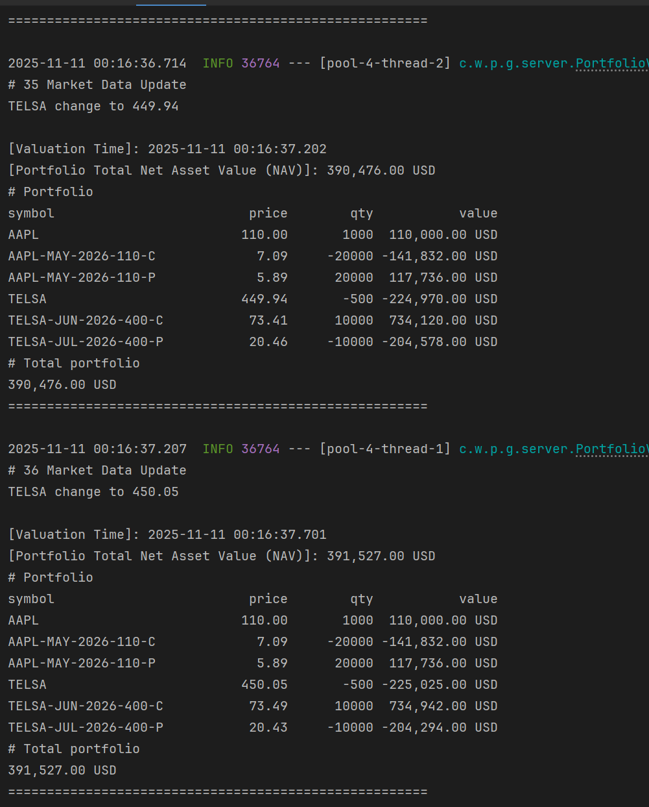

# we_ports_micro: 交易估值系统

> 📑 Financial background knowledge  : [README_FIN.md](README_FIN.md)

## 项目概述

`we_ports_micro` 是一个基于Java生态的实时交易估值系统，专注于投资组合的动态估值计算与推送。系统通过模拟市场数据波动（股票价格），结合金融工程模型（如Black-Scholes期权定价模型）实时计算投资组合净值（NAV），并通过gRPC实现估值结果的高效传输与展示。

核心功能包括：
- 实时市场数据模拟（支持GBM几何布朗运动模型和随机价格模型）
- 股票与期权的持仓估值计算
- 基于gRPC的估值结果流式推送与接收
- 投资组合净值实时展示与更新跟踪


## 系统架构

系统采用微服务架构，包含两个核心模块：

1. **portfolio 模块**（估值计算与发送端）
   - 市场数据生成：模拟股票价格波动（AAPL、TELSA等标的）
   - 估值计算：基于实时市场数据计算股票市值与期权理论价值（Black-Scholes模型）
   - gRPC客户端：将估值结果封装为Protobuf消息并发送

2. **portfolio-receiver 模块**（估值接收与展示端）
   - gRPC服务端：接收估值结果消息
   - 数据处理：解析gRPC消息并转换为本地实体
   - 结果展示：格式化打印投资组合估值详情（含持仓明细、总净值、价格变动）


## 技术栈

- **核心框架**：Spring Boot、Spring webflux、R2DBC、Project Reactor
- **通信协议**：gRPC（基于Protobuf）
- **金融计算**：Black-Scholes期权定价模型、GBM市场数据模拟
- **数据存储**：H2内存数据库（用于存储证券静态信息）
- **构建工具**：Gradle

## 快速开始 - docker (推荐)
- Docker version 27.5.1
- Docker Compose version v2.32.4
> 📑 Docker  : [README_docker.md](README_docker.md)


## 快速开始 - Gradle (不推荐-环境因素可能导致构建失败)

### 环境要求

- JDK 8
- Gradle 8.5


### 启动步骤


1. **启动 portfolio-receiver 模块（估值接收端）**
   ```bash
   # 进入模块目录
   cd portfolio-receiver
   # 构建并启动
   ./gradlew bootRun
   ```
   服务将启动gRPC服务端（默认端口`50052`），并监听来自发送端的估值消息。

2. **启动 portfolio 模块（估值发送端）**
   ```bash
   # 进入模块目录
   cd portfolio
   # 构建并启动
   ./gradlew bootRun
   ```
   服务将启动在默认端口，gRPC客户端会连接到配置的接收端地址（默认`localhost:50052`）。

3. **样例输出**
   

## 核心功能说明

### 1. 市场数据模拟

- **定价策略**：支持两种市场数据生成策略（通过配置`portfolio.market-data.pricing-strategy`切换）：
  - `GBM`：几何布朗运动模型（默认），基于标的的预期收益（μ）和波动率（σ）模拟价格
  - `Random`：随机价格模型，生成指定区间内的随机价格

- **配置参数**（`application.properties`）：
  ```properties
  # 标的初始价格
  portfolio.marketdata.initial-price.AAPL=110.0
  portfolio.marketdata.initial-price.TELSA=450.0
  
  # GBM模型参数（预期收益μ和波动率σ）
  portfolio.marketdata.mu.AAPL=0.08
  portfolio.marketdata.sigma.AAPL=0.2
  portfolio.marketdata.mu.TELSA=0.12
  portfolio.marketdata.sigma.TELSA=0.3
  
  # 价格更新间隔（毫秒）
  portfolio.market-data.min-interval=500
  portfolio.market-data.max-interval=2000
  ```


### 2. 估值计算

- **股票估值**：直接基于市场数据中的实时价格计算市值（价格 × 数量）
- **期权估值**：使用Black-Scholes模型计算理论价格，公式如下：
  - 看涨期权：`C = S*N(d1) - K*e^(-rT)*N(d2)`
  - 看跌期权：`P = K*e^(-rT)*N(-d2) - S*N(-d1)`
  其中 `d1 = (ln(S/K) + (r+σ²/2)T) / (σ√T)`，`d2 = d1 - σ√T`


### 3. gRPC通信

- **协议定义**（`portfolio_valuation.proto`）：
  - 消息类型：包含持仓信息（`PositionProto`）、市场数据变化（`MarketDataChangeProto`）、估值结果（`PortfolioValuationMessage`）
  - 服务接口：支持单次发送（`SendValuation`）和流式发送（`StreamValuations`）

- **数据流程**：
  1. `portfolio` 模块生成估值结果并转换为Protobuf消息
  2. 通过gRPC客户端发送至 `portfolio-receiver`
  3. 接收端解析消息并格式化展示


## 配置说明

核心配置文件为 `src/main/resources/application.properties`，主要配置项包括：

| 配置项 | 说明 | 默认值 |
|--------|------|--------|
| `grpc.server.port` | gRPC服务端端口 | 50052 |
| `grpc.valuation.server.address` | 估值接收端地址 | localhost:50052 |
| `portfolio.option.risk-free-rate` | 无风险利率（用于期权定价） | 0.02 |
| `portfolio.position.csv-path` | 持仓数据CSV文件路径 | classpath:positions.csv |
| `spring.r2dbc.url` | 数据库连接地址（H2内存库） | r2dbc:h2:mem:///webfluxdb |


## 示例输出

接收端成功接收估值结果后，将打印类似以下的信息：

```
# 1 Market Data Update
AAPL change to 112.50
TELSA change to 448.20

【估值时间】：2023-10-01 15:30:45.123
【组合总净资产（NAV）】：156,789.50 USD
# Portfolio
symbol                   price       qty         value
AAPL                     112.50        100    11,250.00 USD
TELSA                    448.20         50    22,410.00 USD
AAPL-MAY-2026-110-C       15.75         20     3,150.00 USD
# Total portfolio
156789.50 USD
======================================================
```


## 扩展指南

1. **添加新的定价策略**：实现 `PricingStrategy` 接口，在 `ReactiveMarketDataProvider` 中注册
2. **支持新的证券类型**：扩展 `SecurityType` 枚举，在估值计算逻辑中添加对应处理
3. **添加新的现货和期权产品**：拓展`schema.sql` ，添加新产品，在positions.csv中添加用户持仓信息。
4  **添加新的股票代码**：拓展portfolio.market-data.stock-tickers=AAPL, TELSA
5. **修改gRPC协议**：更新 `portfolio_valuation.proto` 后重新生成Java代码。
6. **修改H2 存储模式**：参照application.properties 注释部分。

## 注意事项

- 系统使用H2内存数据库，重启后证券静态数据会重置（初始化数据见 `schema.sql`）
- 市场数据模拟仅用于演示，实际生产环境需对接真实行情源
- 期权定价模型中的波动率（σ）需根据实际情况校准