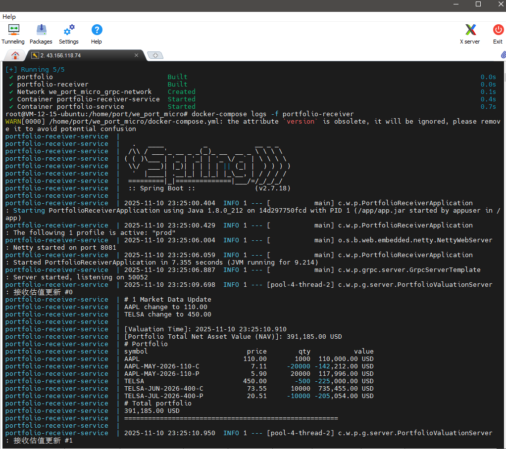

# 构建并启动所有服务
docker-compose up -d --build

# 查看服务状态
docker-compose ps

# 查看日志
docker-compose logs -f

# 查看receiver日志
docker-compose logs -f portfolio-receiver

# 彻底停止并移除容器
docker-compose down

# 样例输出

