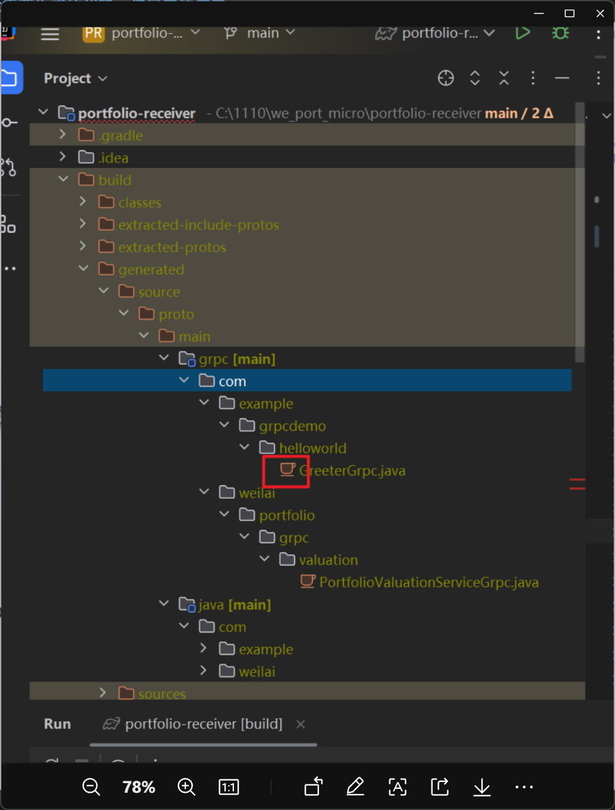
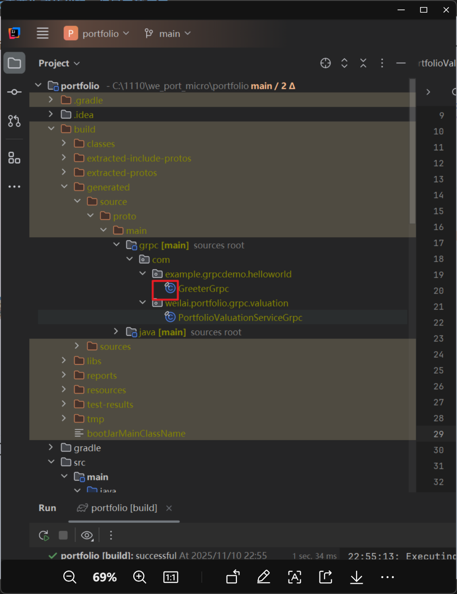

## Issue 1: Generated gRPC Code Fails to Work (Troubleshooting Time: 0.5 Hours)

> 🌐 Chinese Version: [README_issue.md](README_issues_cn.md)





To resolve the issue where generated gRPC code cannot be used, we can analyze and address it from three aspects: IDE source root configuration, build tool (Gradle) configuration, and IDE cache indexing.
1.  **Check the "Sources Root" Configuration**
IntelliJ IDEA requires the directory containing generated gRPC code to be marked as a **Sources Root** to recognize it as compilable source code.
    - For the first project, the "grpc [main]" directory is already marked as a Sources Root (as indicated by the corresponding icon).
    - For the second project: Right-click on the "grpc" directory → Select **Mark Directory as** → Choose **Sources Root**. The directory will then be marked with a blue icon, confirming the configuration.

## Issue 2: Failed to Generate gRPC Code on a Windows 10 Test Machine (Troubleshooting Time: 1.5 Hours)
The root cause is that the Gradle cache path contains Chinese characters. Below are detailed steps to modify the Gradle cache path to an English-only path on Windows 10, especially for scenarios with Chinese usernames. This operation is simple and takes effect globally—after modification, all Gradle projects will use the new English cache path, completely eliminating path-not-found errors caused by Chinese characters.

### Core Principle
By configuring the `GRADLE_USER_HOME` environment variable, we specify Gradle’s cache directory to an English-only path (e.g., `D:\GradleCache\.gradle`), replacing the default path under the Chinese user directory (typically `C:\Users\ChineseUsername\.gradle`).

### Step 1: Create a New English Cache Directory
First, create a new folder with **no Chinese characters, spaces, or special symbols** to serve as the new Gradle cache directory. Examples are as follows:
- Recommended path: `D:\GradleCache\.gradle` (Note: `.gradle` is the folder name, not a file extension; create it directly).
- Alternative paths: `E:\DevTools\Gradle\.gradle` (Ensure all parent directories use English names).

✅ Valid Example: `D:\GradleCache\.gradle`
❌ Invalid Examples:
- `D:\ProgrammingTools\GradleCache\.gradle` (Contains Chinese characters)
- `D:\Gradle Cache\.gradle` (Contains a space)

### Step 2: Configure System Environment Variables (Global Effect, Recommended)
This method applies to all Gradle projects, requiring only one configuration for permanent use:
1. Open the system environment variable settings using one of the following methods:
    - Method 1: On the Windows 10 desktop, right-click **This PC** → Select **Properties** → Click **Advanced system settings** → Go to the **Environment Variables** section.
    - Method 2: Press `Win+R`, enter `sysdm.cpl`, and press Enter. Switch to the **Advanced** tab → Click **Environment Variables**.
2. In the **System Variables** area (not User Variables, to avoid impacts from Chinese user directories), click **New**.
3. Fill in the configuration:
    - Variable Name: `GRADLE_USER_HOME` (Fixed name; case-insensitive, but copying it as-is is recommended).
    - Variable Value: Paste the English cache path created in Step 1 (e.g., `D:\GradleCache\.gradle`).
4. Click **OK** to save the settings.

#### Verify the Environment Variable
Open a **new PowerShell window** (the old window won’t apply the new settings) and run the following command:
```powershell
echo $env:GRADLE_USER_HOME
```
If the output is the path you set (e.g., `D:\GradleCache\.gradle`), the environment variable configuration is successful.

### Step 3: Optional - Project-Level Configuration (Applies Only to the Current Project)
If you don’t want to modify the settings globally and only want the current project to use the English cache path, follow these steps:
1. Create a `gradle.properties` file in the project’s root directory (modify it directly if the file already exists).
2. Add the following configuration:
```properties
# Configure Gradle cache path (replace with your English path)
org.gradle.cache.dir=D:\\GradleCache\\.gradle
```
⚠️ Note: Use double backslashes (`\\`) or forward slashes (`/`) in the path. For example, `D:/GradleCache/.gradle` is also valid.

### Step 4: Verify the Cache Path Takes Effect
1. **Clear Old Caches (Optional but Recommended)**
There’s no need to manually delete the old cache in the Chinese path (it won’t interfere with the new configuration). The new settings will directly use the new path.
2. **Test Gradle Build**
Navigate to the project’s root directory in PowerShell and run the following command to re-download dependencies to the new cache path:
```powershell
./gradlew clean build --refresh-dependencies
```
3. **Confirm the New Cache Path Is in Use**
    - After running the command, open the `D:\GradleCache\.gradle` folder you created. Subfolders like `caches` and `wrapper` will be generated automatically, indicating the cache has been switched to the new path.
    - Check the build log. If you see the message `Using Gradle user home: D:\GradleCache\.gradle`, the configuration is confirmed to take effect.

### Step 5: Rebuild the Project
Once the environment variable takes effect, run the following command again to build the project:
```powershell
./gradlew build
```
At this point, Gradle will read or download `protoc` and the `protoc-gen-grpc-java` plugin from the new English cache path. The issue of "path not found" caused by Chinese usernames will be resolved completely.